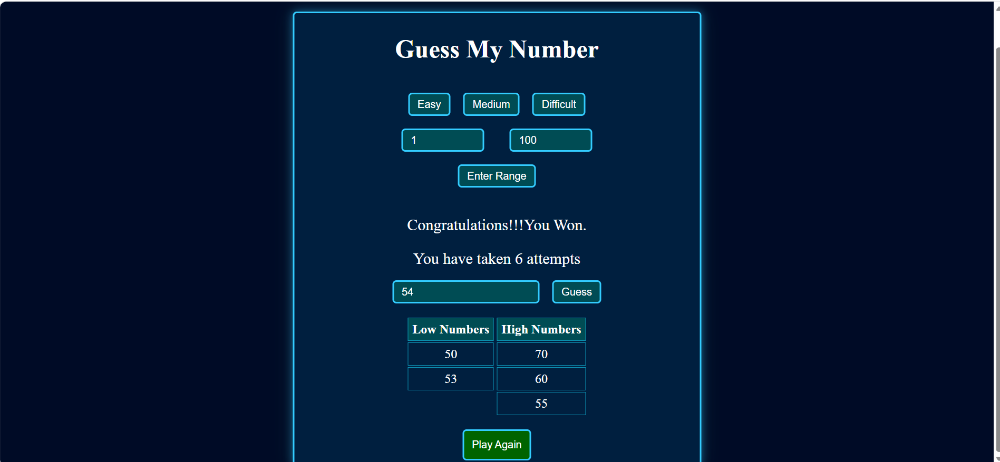

# 🎯 Guess My Number Game

An interactive web-based Number Guessing Game built using **HTML, CSS, and JavaScript**. Players choose a custom range and try to guess a randomly generated number within a limited number of attempts. The game provides real-time hints, tracks guess history, and offers an engaging user experience.

---

## 📸 Screenshot




---

## 🚀 Features

- Custom number range selection
- Random number generation
- Real-time higher/lower hints
- Attempt tracking
- Duplicate guess prevention
- Guess history tables
  - Low guesses
  - High guesses
- Input validation
- Responsive and modern UI
- Enter key support for faster gameplay
- Play Again functionality

---

## 🛠️ Technologies Used

- HTML5
- CSS3
- JavaScript (ES6)

---

## 🎮 How to Play

1. Enter the starting and ending range.
2. Click **Enter** to generate a random number.
3. Type your guess in the input field.
4. Click **Guess** or press **Enter**.
5. The game will provide hints:
   - "My number is greater than..."
   - "My number is lower than..."
6. Continue guessing until:
   - You find the correct number, or
   - You run out of attempts.

---

## 📂 Project Structure

```text
NumberGuessGame/
│
├── index.html
├── README.md
└── screenshots/
    └── game-screenshot.png
```

---

## 💡 Concepts Practiced

- DOM Manipulation
- Event Handling
- Conditional Statements
- Arrays
- Random Number Generation
- Form Validation
- Dynamic Table Creation
- Responsive Design

---

## 🔧 Future Improvements

- Best Score Tracking using Local Storage
- Hot/Cold Hint System
- Sound Effects
- Dark Mode Toggle
- Leaderboard
- Mobile Optimization

---


## 👨‍💻 Author

Developed by **Jhansi Kasa**

If you like this project, feel free to ⭐ the repository.
